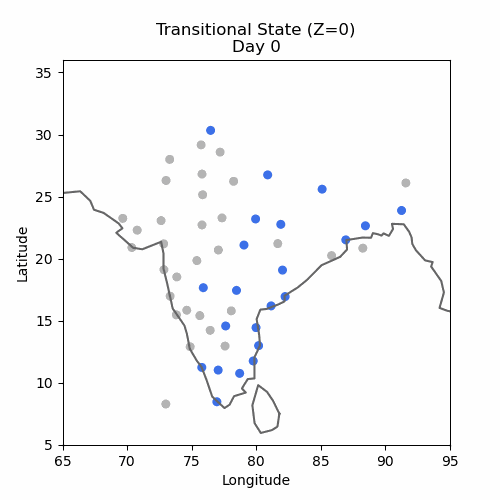
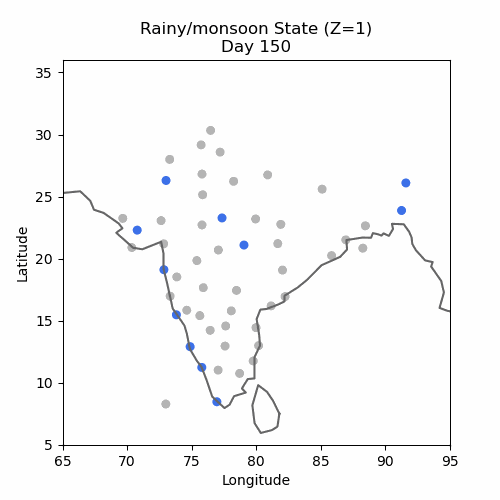
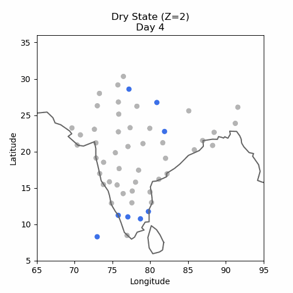
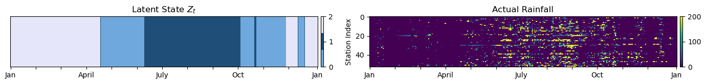
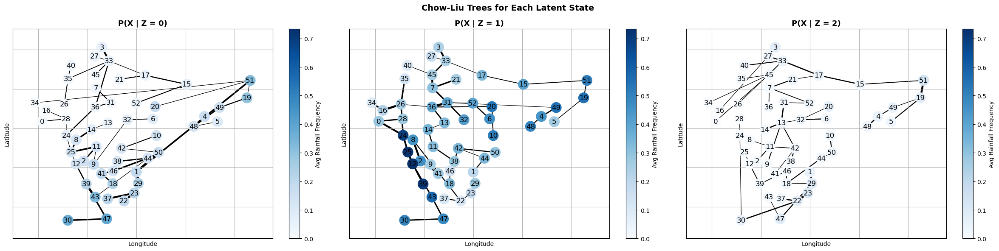
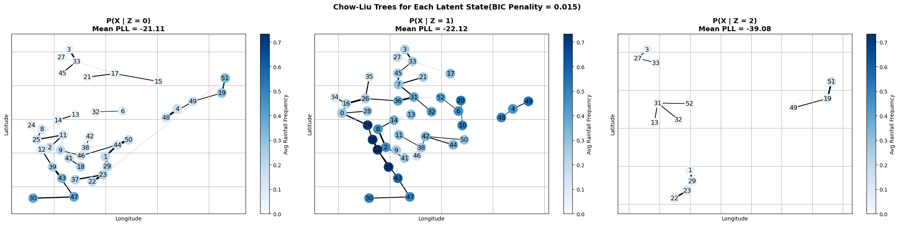
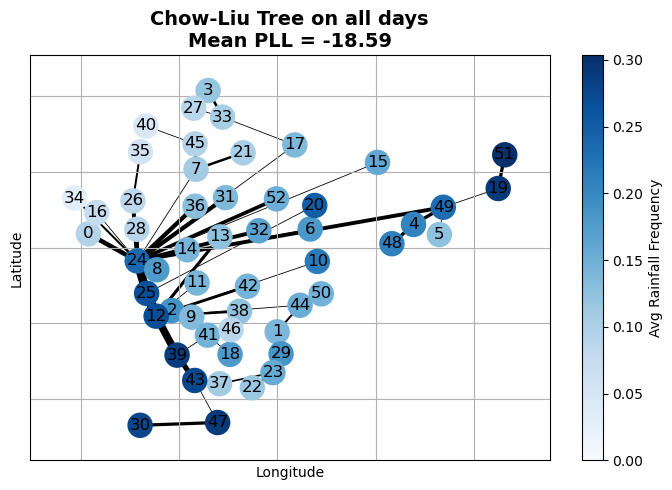

# spatio temporal rainfall modeling

 **Hidden Markov Models (HMMs)** with **Chow–Liu tree** emissions for modeling seasonal rainfall patterns in India

## Project Overview

This project applies latent variable modeling and structure learning methods to analyze ten years of daily binary rainfall events across 54 weather stations in India. The goal is to uncover large scale seasonal rainfall regimes and understand how spatial dependency patterns change across these regimes. A Hidden Markov Model captures the temporal dynamics of latent seasonal states, while each state's spatial structure is learned using a Chow Liu tree constructed as a maximum spanning tree over pairwise mutual information. This results in interpretable latent regimes, each with its own learned spatial dependency structure.

Learning is performed with the **Baum Welch algorithm**, a specific instance of **Expectation Maximization**:

**E step**: computes the posterior distribution over latent states for each day using forward backward algorithm.

**M step**:maximizes the expected log likelihood by updating the transition probabilities and relearning a separate Chow Liu tree for each state using data weighted by the state posteriors, allowing each tree structure to adapt as the latent assignments evolve.

For more details, see [Report.pdf](Report.pdf).

This project is inspired by [this paper](https://arxiv.org/abs/1207.4142):

> Kirshner, S., Smyth, P., & Robertson, A. W. (2004). Conditional Chow–Liu tree structures for modeling discrete-valued vector time series. *Proceedings of the 20th Conference on Uncertainty in Artificial Intelligence (UAI'04)*, pp. 317–324. AUAI Press.

---

<!--
## Hidden Markov Models with Chow–Liu Tree Emissions 
-->

**Latent Temporal states:**

The HMM models daily rainfall occurrence as a sequence of hidden states, with each of the **three latent states** representing a distinct seasonal rainfall pattern: transitional (z=0), monsoon (z=1), and dry (z=2).

Each animation visualizes binary rainfall occurrence for all days assigned to each hidden state:

      

The plot below shows, for a single year, the inferred latent seasonal state sequence (left) alongside the actual daily rainfall observations across all stations (right). Each day is assigned to the state with the highest posterior probability from the forward–backward algorithm, illustrating how the HMM segments the year into transitional, monsoon, and dry periods.

 

A complete ten year sequence of observed rainfall and inferred hidden states is included
**[here](assets/states_all_years.png)**.

**Learned spatial dependencies:**

The emission distribution p(x|z=k) for each latent state z is modeled using a Chow-Liu tree, which captures spatial dependencies across
stations via a tree-structured Ising model. The edges of the tree are selected to form a maximum-weight spanning tree based on 
mutual information between pairs of stations.

* Node colors represent the average rainfall frequency at each station across all days assigned to the corresponding latent state, edge width indicates the strength of Mutual Information between stations.
*  Z = 0 corresponds to transitional season, Z = 1 corresponds to Rainy/Monsoon season, Z=2 corresponds to dry season.

---
## Adding BIC penalty to Chow-Liu Trees
Adding a BIC penalty lets the Chow–Liu procedure prune weak edges, so instead of forcing a fully connected tree, it can return a smaller forest that keeps only the strongest spatial dependencies.

 

After adding the BIC penalty, the monsoon state still showed strong coastal links, the transitional state preserved only its major rainy-region edges, and the dry state became almost empty, 
highlighting the much weaker mutual information during the dry season.

<!--
---
## Baseline comparison
 

To evaluate the effectiveness of the HMM plus Chow Liu model, we compare it to a baseline consisting of a single global Chow Liu tree learned on the full ten year dataset. Quantitatively, the global Chow Liu model achieves a mean pseudo log likelihood per day of −18.59, while the EM learned HMM with state dependent Chow Liu emissions achieves −15.89, which is an improvement of about 14.5 percent. Qualitatively, the global model produces long range edges between distant stations, whereas the state dependent Chow Liu trees yield more coherent and regionally consistent dependency patterns, especially in the rainy season state.

 
---
## Model Selection

We use two model selection methods to choose the number of latent temporal states for the HMM.

- **LOOCV:** The data is split into ten folds (years). For each fold, the model is trained on nine years and evaluated on the held-out year, and the held-out pseudo-log-likelihood per day (PLL/day) is used as the model selection metric.
- **BIC:**  Models with different latent state counts are evaluated using the BIC score, which balances fit and complexity, lower BIC score indicate a better trade-off.
  
<table style="width:100%;">
<tr>

<td style="width:50%; padding-right:40px; vertical-align:top;" markdown="1">

### LOOCV Results

| **K** | **Mean PLL** |
|------|--------------|
| 2    | -17.08       |
| 3    | -16.78       |
| 4    | **-16.71**   |
| 5    | -16.86       |

</td>

<td style="width:50%; padding-left:40px; vertical-align:top;" markdown="1">

### BIC Results

| **K** | **BIC**     |
|------|-------------|
| 2    | 123,780     |
| 3    | **118,692** |
| 4    | 118,951     |
| 5    | 119,264     |

</td>

</tr>
</table>

LOOCV favored \(k = 4\) and BIC favored \(k = 3\); to avoid redundancy and maintain interpretability, the three-state HMM was selected.
-->
---

## Acknowledgements

This project was made as the final project for my Graphical Models class at UCI. 

I would like to thank Prof. Alexander Ihler for his guidance, class materials, and his [pyGMs](https://github.com/ihler/pyGMs) library used in this project.

---

## Code Resources

- The Baum–Welch learning algorithm was borrowed from the CS179 class material ([ActivityHMM](https://ics.uci.edu/~ihler/classes/cs179/Demo%20-%20ActivityHMM.html)).

- The Chow–Liu implementation was borrowed and lightly modified from the [pyGMs](https://github.com/ihler/pyGMs) library (see `pyGMs-license.txt`).

---

## Citations
[1] Kirshner, S., Smyth, P., & Robertson, A. W. (2004). Conditional Chow–Liu tree structures for modeling discrete-valued vector time series.
UAI’04.
https://arxiv.org/abs/1207.4142

[2] Ihler, A. T., et al. Graphical Models for Statistical Inference and Data Assimilation.
https://www.ics.uci.edu/~ihler/papers/physd07.pdf

[3] pyGMs Library (Alexander Ihler).
https://github.com/ihler/pyGMs
